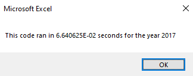

# VBA Challenge

## Overview of Project

The purpose of this project was to gain experience with VBA while learning about ways to make code more efficient and expedient. This involved working through the creation of various macros within VBA, then refactoring and improving those macros to decrease runtime.

## Results

It is clear that the execution time of the analysis dropped dramatically after refactoring. The original runtimes are shown below:

while the runtimes for the refactored code are shown below:

The execution time for the refactored script was roughly 10% of the execution time for the original code. The difference between 0.6 and 0.06 seconds might not be very noticeable, but changes of this magnitude are extremely noticeable when applied to longer, more complicated scripts. For example, if a script's runtime can be decreased from 10 minutes to 1 minute, that is a huge improvement.

This change in runtime is largely due to the use of arrays instead of a nested for loop. When the following code is used to create arrays for volume, starting price, and ending price

    Dim tickerVolumes(11) As Long
    Dim tickerStartingPrices(11) As Single
    Dim tickerEndingPrices(11) As Single
    
then there is no need for a nested for loop to run through each ticker, such as the example below:

    for each ticker
        for each row
        
        ' interact with data
        
        next row
    next ticker
    
This speeds up the code dramatically, as for loops tend to increase runtime.

## Summary

### Advantages and Disadvantages of Refactoring Code

Refactoring code is very much a net gain process. While it might take a little bit of time to go through old code and make the necessary changes, the time saved on future uses of the code will make up for it. Not only will that specific code run more efficiently going forward, but you will likely learn ways to write code more efficiently from the jump and save time on refactoring in the future as well.

### Advantages and Disadvantages of Refactoring the Original VBA Script in This Project

As it pertains to the code for this specific project, I can only think of one potential con - the code being a little bit more difficult for a new coder to write or understand. When I first started writing code, mostly in Python, I found it easy to write and follow along with for loops. It was just a natural way for my brain to walk through datasets, so it became my default. Clearly, for loops are not the most efficient way to write code, so refactoring them using arrays is a great way to improve a given bit of code. It just might come with a bit of a learning curve for some, including myself.
